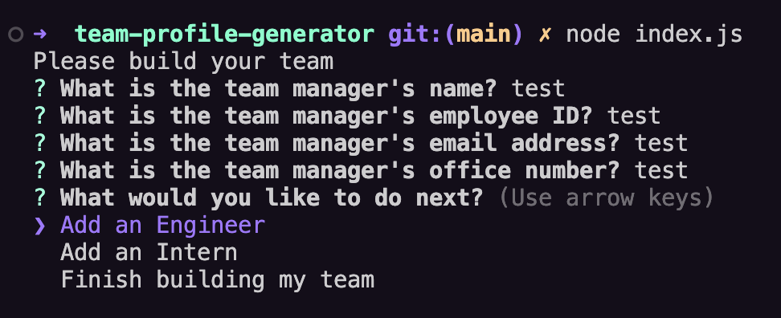
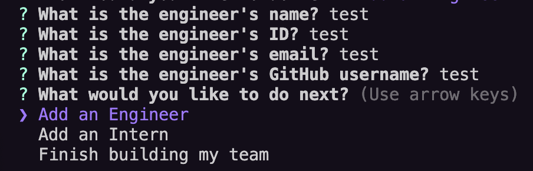
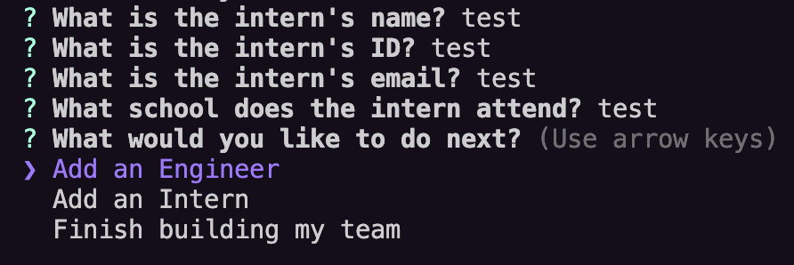
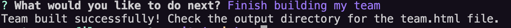
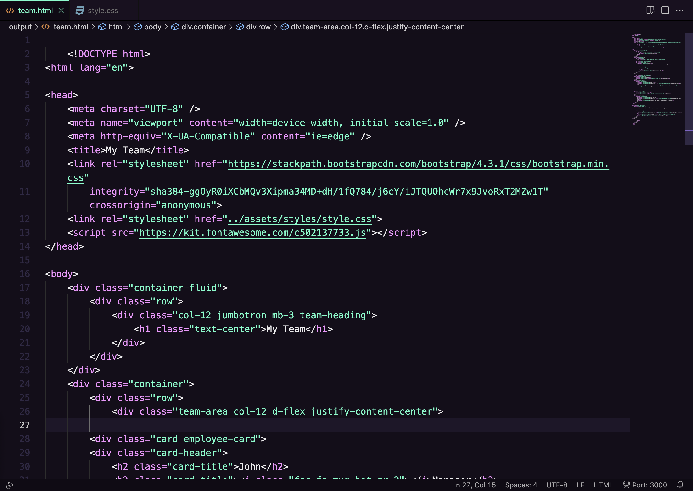

# team-profile-generator

## Description
This project is an app designed for the end user to be able to create a profile for their team, right from the command line.

## Installation
This package requires the user to have Node.js installed on their local machine to be able to run the application.

## Usage
When the user opens this project, they should run node index.js in their terminal to trigger the start of the application. They will be taken through a questionnaire to create a profile for each member of the team, starting with the manager, with the option to add multiple engineers and interns along with their details. Please see the below screenshots for the details collected about each employee.

Manager

Engineer

Intern

Complete team

After the user selects "Finish building my team", an output folder, with an html folder inside, will be automatically generated, as in the screenshot below:

For demonstration purposes, I have included my own Beatles themed team within this project, please see the screenshots below for the HTML file that was automatically created and how it would look on the browser, with some basic styling added:

Created HTML file:

Browser view:

## Authors and acknowledgment
Many thanks to edX for the starter code for this project, and https://www.ctvnews.ca/ for the Beatles image I used.

## License
MIT License